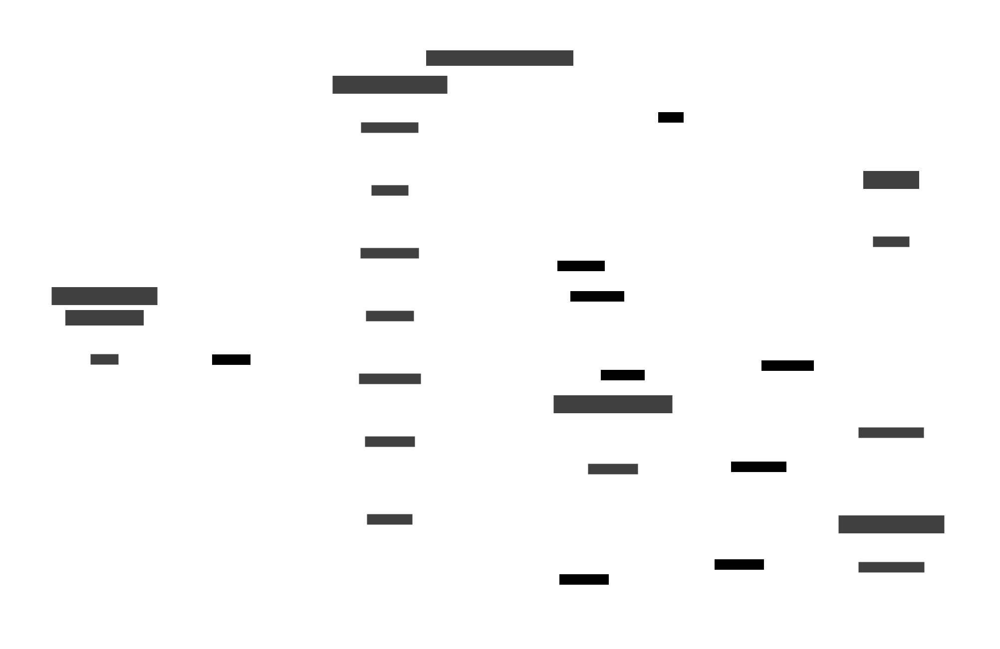

# Design: ba-drb - Circle Editor Screen UI Layout and Interactions

## Overview

Design a full-screen circle editor that allows users to edit circle name, manage members via search-and-add, and delete the circle. Changes require explicit save action.

## UI Layout


## Interaction Flow



## Screen Components

### 1. Toolbar
- **Back button** (←) - Discard changes and return
- **Title** - "Edit Circle" or circle name
- **Overflow menu** (⋮) - Contains "Delete Circle" option

### 2. Circle Name Section
- **TextInputLayout** with TextInputEditText
- Pre-filled with current circle name
- Validation: non-empty required
- Error state shown in TextInputLayout

### 3. Members Section

#### Header
- "Members (N)" - Shows count of current members

#### Search Input
- SearchView or TextInputEditText with search icon
- Placeholder: "Search contacts..."
- Filters available contacts as user types

#### Search Suggestions
- RecyclerView that appears below search when typing
- Shows matching contacts NOT already in circle
- Each item: Avatar + Name
- Tap to add contact to members list
- Dismisses when search cleared or item selected

#### Current Members List
- RecyclerView showing current circle members
- Each item: Avatar + Name + Remove button (✕)
- Tap remove button to mark for removal (visual indicator)
- Changes are staged until Save

### 4. Save Button
- MaterialButton Primary style at bottom
- "Save Changes" text
- Disabled until changes made
- Persists all staged changes on tap

## Entry Point

**Long-press on circle chip** in ContentFragment's filter bar:
- CircleFilterAdapter handles long-press
- Navigates to EditCircleFragment with circle ID argument

## Interactions

### Opening Editor
1. User long-presses circle chip in filter bar
2. Navigate to EditCircleFragment with `circleId` argument
3. Load circle data and members from database
4. Populate UI with current values

### Editing Name
1. User modifies text in name input
2. Enable Save button
3. Validate on text change (non-empty)

### Adding Members
1. User types in search field
2. Filter contacts matching query (exclude current members)
3. Show suggestions dropdown
4. User taps contact to add
5. Add to members list (visually)
6. Clear search, hide suggestions
7. Enable Save button

### Removing Members
1. User taps ✕ on member row
2. Mark member for removal (gray out or strikethrough)
3. Enable Save button
4. (Optional: tap again to undo)

### Saving Changes
1. User taps "Save Changes"
2. Validate circle name
3. Update circle name in CircleDao
4. Process member changes:
   - Insert new CircleMember entries
   - Delete removed CircleMember entries
5. Show success toast
6. Navigate back with result

### Deleting Circle
1. User taps overflow menu → "Delete Circle"
2. Show AlertDialog confirmation:
   - Title: "Delete Circle"
   - Message: "Are you sure you want to delete '[name]'? This cannot be undone."
   - Buttons: Cancel / Delete
3. On confirm:
   - Delete all CircleMember entries for circle
   - Delete Circle entry
   - Show toast
   - Navigate back with result
4. **Note**: Prevent deletion of "everyone" circle (hide option or show error)

### Back/Cancel
1. If changes pending, optionally show "Discard changes?" dialog
2. Navigate back without saving

## New Components

### Files to Create

| File | Purpose |
|------|---------|
| `EditCircleFragment.kt` | Fragment with editor logic |
| `fragment_edit_circle.xml` | Layout with toolbar, inputs, lists |
| `CircleMemberAdapter.kt` | Adapter for current members with remove |
| `ContactSearchAdapter.kt` | Adapter for search suggestions |
| `item_circle_member.xml` | Layout for member row with remove button |
| `item_contact_suggestion.xml` | Layout for search suggestion row |

### Files to Modify

| File | Change |
|------|--------|
| `CircleFilterAdapter.kt` | Add long-press listener |
| `ContentFragment.kt` | Handle long-press callback, navigation |
| `navigation.xml` | Add editCircleFragment destination |
| `strings.xml` | Add new strings |

## String Resources

```xml
<string name="edit_circle">Edit Circle</string>
<string name="circle_name">Circle Name</string>
<string name="members_count">Members (%d)</string>
<string name="search_contacts">Search contacts...</string>
<string name="save_changes">Save Changes</string>
<string name="delete_circle">Delete Circle</string>
<string name="delete_circle_confirm">Are you sure you want to delete \"%s\"? This cannot be undone.</string>
<string name="circle_updated">Circle updated</string>
<string name="circle_deleted">Circle deleted</string>
<string name="cannot_delete_everyone">Cannot delete the default circle</string>
<string name="circle_name_required">Circle name is required</string>
<string name="discard_changes">Discard changes?</string>
<string name="discard_changes_message">You have unsaved changes. Discard them?</string>
<string name="discard">Discard</string>
```

## State Management

Track pending changes in fragment:
- `originalName: String` - Initial circle name
- `pendingName: String` - Current edited name
- `addedMembers: MutableSet<Long>` - IDs to add
- `removedMembers: MutableSet<Long>` - IDs to remove
- `hasChanges: Boolean` - Computed from above

## Architectural Considerations

- **Reuses patterns**: DataBinding, BailiwickFragment, coroutines
- **New adapters needed**: CircleMemberAdapter (with remove), ContactSearchAdapter
- **Staged changes**: Changes collected in memory, persisted on explicit save
- **Navigation result**: Pass back updated circle ID for ContentFragment to refresh

## Performance Considerations

- Load contacts list once on fragment create
- Filter in memory for search (contact list typically small)
- Batch database operations in single transaction on save
- No network calls needed for local circle management
