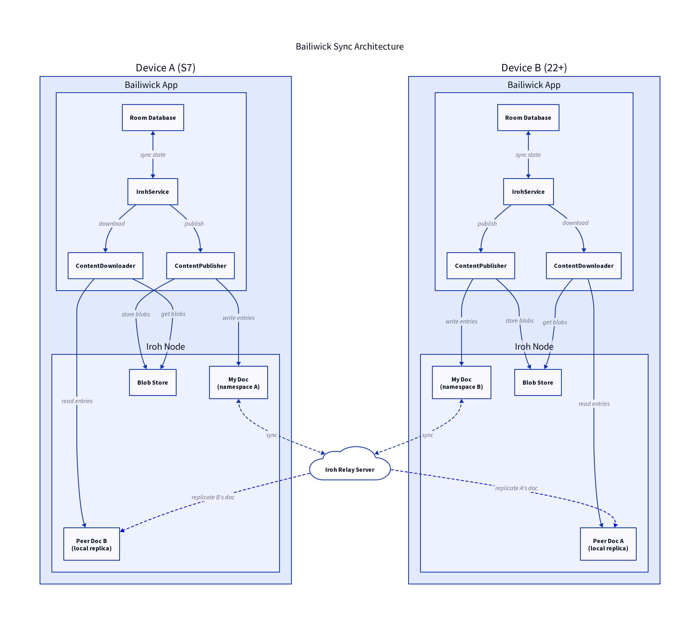

# Sync Architecture Overview

## Components

### IrohService (Foreground Service)
The `IrohService` runs as an Android foreground service, triggering periodic sync operations. It:
- Runs every 60 seconds when active
- Coordinates between publishing and downloading
- Survives app backgrounding via foreground notification

### ContentPublisher
Publishes local content to the user's Iroh Doc:
- Identity (profile name, picture)
- Circles (member lists)
- Posts (encrypted with circle keys)
- Actions (key exchanges with peers)

### ContentDownloader
Downloads content from subscribed peer Docs:
- Joins peer Docs using stored tickets
- Waits for sync completion
- Downloads and decrypts content using stored keys

### My Doc
Each user owns one Iroh Doc that contains all their published content. The Doc is a mutable key-value store where:
- **Keys** identify content type (e.g., `posts/1/1704067200000`)
- **Values** are blob hashes pointing to the actual content

### Peer Docs
When users connect, they subscribe to each other's Docs by:
1. Scanning QR codes containing Doc tickets
2. Storing `PeerDoc` records mapping nodeId to docTicket
3. Periodically syncing to receive updates

## Data Flow

1. User creates content locally (stored in Room DB)
2. `ContentPublisher` encrypts and publishes to My Doc
3. `IrohService` triggers sync periodically
4. Peers run `ContentDownloader` to sync from My Doc
5. Downloaded content is decrypted using exchanged keys
6. Content appears in peer's feed

## Key Design Decisions

- **Append-only posts**: Each post gets a unique key with timestamp, avoiding overwrite conflicts
- **Circle-based encryption**: Content encrypted per-circle, keys exchanged via actions
- **Pull-based model**: Users pull content from peers, not push-based
