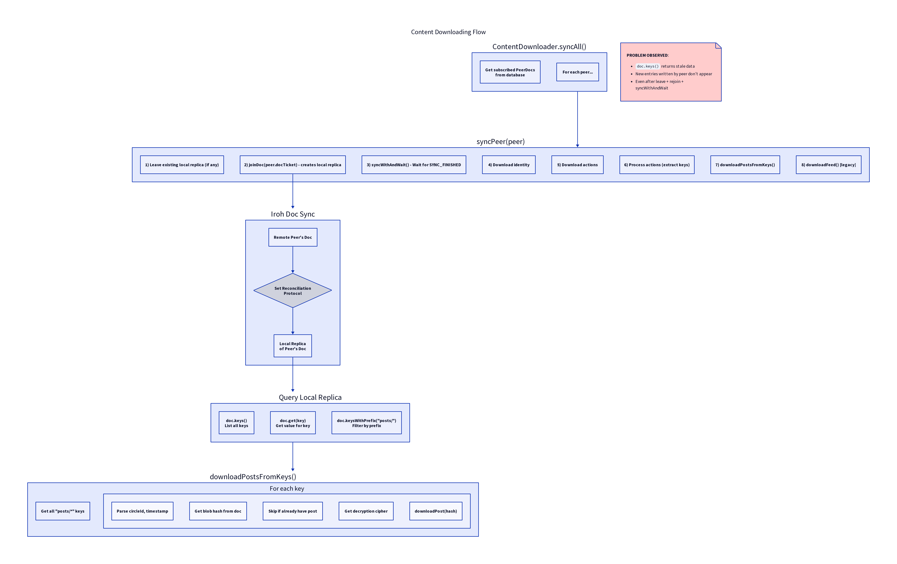

# Content Downloading Flow



## Overview

`ContentDownloader` syncs content from subscribed peer Docs. It runs periodically via `IrohService` and handles:
- Joining peer Docs
- Waiting for sync completion
- Downloading identity, actions, and posts
- Decrypting content with stored keys

## Main Entry Point

```kotlin
suspend fun syncAll() {
    val peers = db.peerDocDao().getAll()
    for (peer in peers) {
        syncPeer(peer)
    }
}
```

## Per-Peer Sync Process

```kotlin
suspend fun syncPeer(peer: PeerDoc) {
    // 1. Leave existing replica (forces fresh sync)
    iroh.openDoc(peer.docNamespaceId)?.leave()

    // 2. Join the peer's Doc
    val doc = iroh.joinDoc(peer.docTicket)

    // 3. Wait for sync to complete
    val success = doc.syncWithAndWait(peer.nodeId, timeout = 30_000)
    if (!success) {
        Log.w(TAG, "Sync timed out for ${peer.nodeId}")
    }

    // 4. Download content in order
    downloadIdentity(doc, peer)
    downloadActions(doc, peer)
    processActions()  // Extract keys immediately!
    downloadPostsFromKeys(doc, peer)
    downloadFeed(doc, peer)  // Legacy, for backwards compatibility
}
```

## Iroh Doc Sync

When joining a peer's Doc, Iroh:
1. Creates a **local replica** of the Doc
2. Uses **set reconciliation** to sync entries
3. Fires `SYNC_FINISHED` event when complete

```kotlin
val doc = iroh.joinDoc(ticket)  // Creates local replica
doc.syncWithAndWait(peerId)     // Waits for SYNC_FINISHED
doc.keys()                      // Query local replica
```

## Downloading Posts by Key

The new key-based approach scans for post entries directly:

```kotlin
suspend fun downloadPostsFromKeys(doc: IrohDoc, peer: PeerDoc) {
    // Get all keys starting with "posts/"
    val postKeys = doc.keys().filter { it.startsWith("posts/") }

    for (key in postKeys) {
        // Parse: posts/{circleId}/{timestamp}
        val parts = key.split("/")
        val circleId = parts[1].toLong()
        val timestamp = parts[2].toLong()

        // Skip if we already have this post
        if (db.postDao().findByTimestamp(timestamp) != null) continue

        // Get the blob hash from the Doc entry
        val blobHash = doc.get(key)?.toHexString() ?: continue

        // Get decryption cipher for this peer
        val cipher = cipherForPeer(peer.nodeId)

        // Download and decrypt the post
        downloadPost(blobHash, cipher, peer, circleId)
    }
}
```

## Downloading Individual Posts

```kotlin
suspend fun downloadPost(
    hash: BlobHash,
    cipher: Decryptor,
    peer: PeerDoc,
    circleId: Long
) {
    // Download encrypted blob
    val encryptedBytes = iroh.getBlob(hash) ?: return

    // Decrypt post JSON
    val postJson = cipher.decrypt(encryptedBytes)
    val irohPost = gson.fromJson(postJson, IrohPost::class.java)

    // Create local Post record
    val post = Post(
        authorId = peer.nodeId,
        text = irohPost.text,
        timestamp = irohPost.timestamp,
        blobHash = hash
    )
    val postId = db.postDao().insert(post)

    // Download files
    for (fileDef in irohPost.files) {
        downloadFile(fileDef, cipher, postId)
    }
}
```

## MultiCipher for Decryption

Peers may have multiple keys (one per circle). `MultiCipher` tries each:

```kotlin
class MultiCipher(private val ciphers: List<Decryptor>) : Decryptor {
    override fun decrypt(data: ByteArray): ByteArray {
        for (cipher in ciphers) {
            try {
                val result = cipher.decrypt(data)
                if (isValidJson(result)) return result
            } catch (e: Exception) {
                continue  // Try next key
            }
        }
        throw DecryptionException("No valid key found")
    }
}
```

## Problem: Stale Replica

We've observed that after sync:
- `doc.keys()` returns stale data
- New entries written by the peer don't appear
- Even after leave + rejoin + syncWithAndWait

This is documented in [Sync Failure Analysis](sync-failure.md).

## Key Points

1. **Leave before join**: Forces fresh replica to avoid stale data
2. **Process actions immediately**: Keys must be extracted before downloading posts
3. **Key-based discovery**: Scan `posts/*` keys instead of reading `feed/latest`
4. **MultiCipher**: Handles multiple encryption keys per peer
