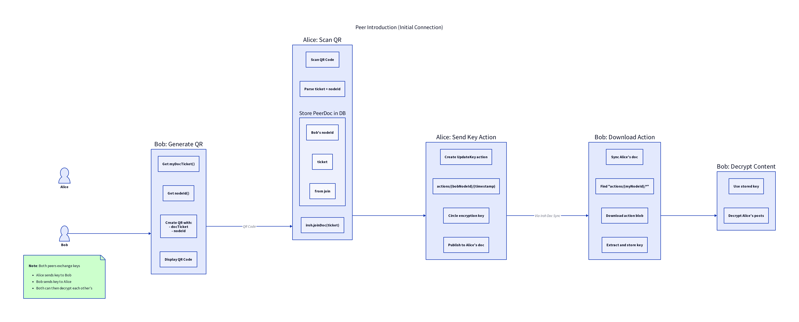

# Peer Introduction Flow



## Overview

When two users want to connect, they exchange Doc tickets via QR codes. This enables both parties to:
1. Subscribe to each other's Docs
2. Exchange encryption keys
3. View each other's encrypted content

## Steps

### Step 1: Bob Generates QR Code

Bob's device creates a QR code containing:
- **Doc Ticket**: Read-only access ticket to Bob's Doc
- **Node ID**: Bob's peer identifier for the P2P network

```kotlin
val qrData = QRData(
    docTicket = iroh.getMyDocTicket(),
    nodeId = iroh.getNodeId()
)
```

### Step 2: Alice Scans QR Code

Alice scans the QR and:
1. Parses the ticket and nodeId
2. Joins Bob's Doc: `iroh.joinDoc(ticket)`
3. Stores a `PeerDoc` record mapping Bob's nodeId to his Doc

```kotlin
val doc = iroh.joinDoc(ticket)
db.peerDocDao().insert(PeerDoc(
    nodeId = qrData.nodeId,
    docTicket = ticket,
    docNamespaceId = doc.namespaceId
))
```

### Step 3: Alice Sends Key Action

Alice creates an `UpdateKey` action to share her circle's encryption key with Bob:

```kotlin
val action = IrohAction(
    type = ActionType.UpdateKey,
    timestamp = System.currentTimeMillis(),
    data = Base64.encode(circleKey)
)
// Write to Alice's Doc at: actions/{bobNodeId}/{timestamp}
myDoc.set("actions/${bobNodeId}/${timestamp}", actionBlobHash)
```

### Step 4: Bob Downloads Action

Bob's `ContentDownloader` syncs Alice's Doc and finds actions targeted at him:

```kotlin
val actions = doc.keysWithPrefix("actions/${myNodeId}/")
for (key in actions) {
    val actionBlob = iroh.getBlob(doc.get(key))
    val action = deserialize(actionBlob)
    if (action.type == ActionType.UpdateKey) {
        db.keyDao().insert(Key(peerId = alice.nodeId, key = action.data))
    }
}
```

### Step 5: Bob Decrypts Content

With Alice's key stored, Bob can now decrypt her posts using the `MultiCipher`:

```kotlin
val cipher = MultiCipher(
    db.keyDao().keysForPeer(alice.nodeId).map { AesCipher(it.key) }
)
val postJson = cipher.decrypt(encryptedBlob)
```

## Bidirectional Exchange

Both peers exchange keys with each other:
- Alice sends her key to Bob via `actions/{bobNodeId}/...`
- Bob sends his key to Alice via `actions/{aliceNodeId}/...`

After both sides process actions, they can each decrypt the other's content.

## Database Records

### PeerDoc
Maps a peer's Node ID to their Doc subscription:
```kotlin
data class PeerDoc(
    val nodeId: String,      // Peer's Ed25519 public key
    val docTicket: String,   // Read-only ticket to their Doc
    val docNamespaceId: String // Doc namespace for reference
)
```

### Key
Stores encryption keys received from peers:
```kotlin
data class Key(
    val peerId: String,  // Who sent this key
    val key: ByteArray   // AES key bytes
)
```
