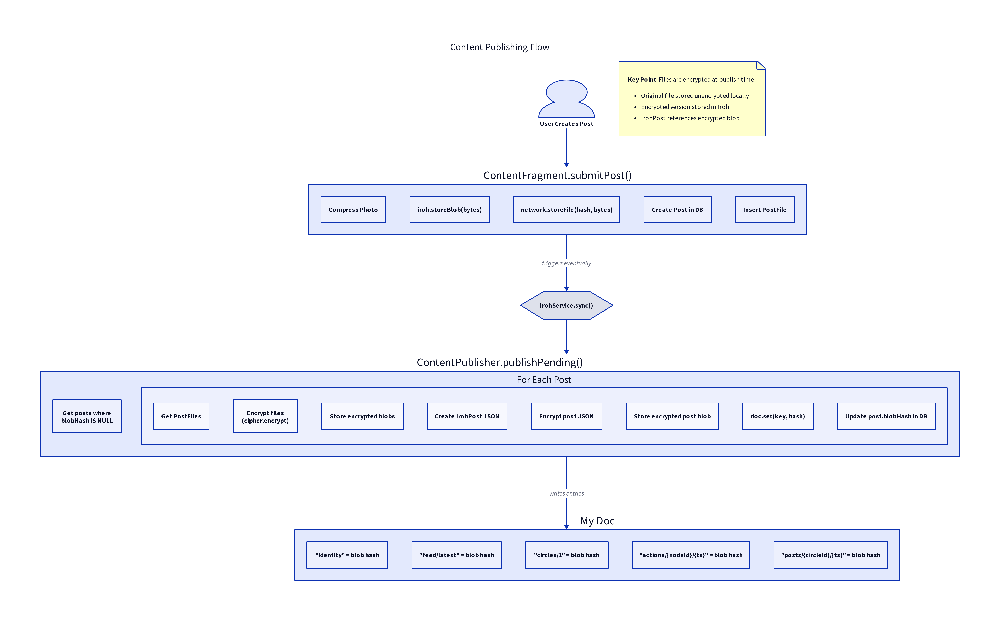

# Content Publishing Flow



## Overview

Content publishing happens in two phases:
1. **Immediate**: User creates content, stored locally in Room DB
2. **Background**: `ContentPublisher` encrypts and publishes to Iroh Doc

## Phase 1: Content Creation

When the user creates a post in `ContentFragment`:

```kotlin
fun submitPost() {
    // 1. Compress and store photo locally
    val photoBytes = compressPhoto(selectedImage)
    val blobHash = iroh.storeBlob(photoBytes)

    // 2. Create Post record (blobHash = null, not yet published)
    val post = Post(
        text = postText,
        timestamp = System.currentTimeMillis(),
        blobHash = null  // Will be set after publishing
    )
    val postId = db.postDao().insert(post)

    // 3. Create PostFile linking post to photo
    val postFile = PostFile(
        postId = postId,
        blobHash = blobHash,
        mimeType = "image/jpeg"
    )
    db.postFileDao().insert(postFile)
}
```

## Phase 2: Background Publishing

`IrohService` periodically triggers `ContentPublisher.publishPending()`:

```kotlin
suspend fun publishPending() {
    // Find posts not yet published (blobHash is null)
    val pendingPosts = db.postDao().unpublishedPosts()

    for (post in pendingPosts) {
        val circle = db.circleDao().getDefault()
        val cipher = cipherForCircle(circle.id)

        // Publish and get the encrypted blob hash
        val blobHash = publishPost(post, circle.id, cipher)

        // Mark as published
        post.blobHash = blobHash
        db.postDao().update(post)
    }
}
```

## Encryption at Publish Time

Files are encrypted during publishing, NOT at creation time:

```kotlin
suspend fun publishPost(post: Post, circleId: Long, cipher: Encryptor): BlobHash {
    val files = db.postFileDao().filesForPost(post.id)

    // Encrypt each file and get new blob hashes
    val encryptedFiles = mutableListOf<IrohFileDef>()
    for (file in files) {
        val fileData = iroh.getBlob(file.blobHash)  // Original unencrypted
        val encryptedHash = publishFile(fileData, cipher)  // Store encrypted
        encryptedFiles.add(IrohFileDef(file.mimeType, encryptedHash))
    }

    // Create IrohPost with encrypted file references
    val irohPost = IrohPost(
        timestamp = post.timestamp,
        text = post.text,
        files = encryptedFiles,  // Encrypted blob hashes
        signature = post.signature
    )

    // Encrypt and store the post JSON
    val postJson = gson.toJson(irohPost)
    val encryptedPost = cipher.encrypt(postJson.toByteArray())
    val postHash = iroh.storeBlob(encryptedPost)

    // Write to Doc: posts/{circleId}/{timestamp} -> postHash
    val key = "posts/${circleId}/${post.timestamp}"
    myDoc.set(key, postHash.toByteArray())

    return postHash
}
```

## Doc Entry Format

After publishing, the Doc contains:

| Key | Value |
|-----|-------|
| `posts/1/1704067200000` | `58d47ae784f6...` (blob hash) |

The blob contains encrypted JSON:
```json
{
  "timestamp": 1704067200000,
  "text": "Hello world!",
  "files": [
    {"mimeType": "image/jpeg", "blobHash": "encrypted-hash"}
  ],
  "signature": "..."
}
```

## Why Append-Only?

Each post gets a unique key based on timestamp. This design:
- Avoids overwrite conflicts (unlike `feed/latest`)
- Enables efficient key-based discovery
- Works better with Iroh's set reconciliation
- Scales to many posts without growing a single entry

## Key Points

1. **Local-first**: Content stored in Room DB immediately
2. **Encryption on publish**: Files encrypted when publishing, not at creation
3. **Unique keys**: `posts/{circleId}/{timestamp}` prevents conflicts
4. **Two-phase storage**: Original file stored locally, encrypted version in Iroh
