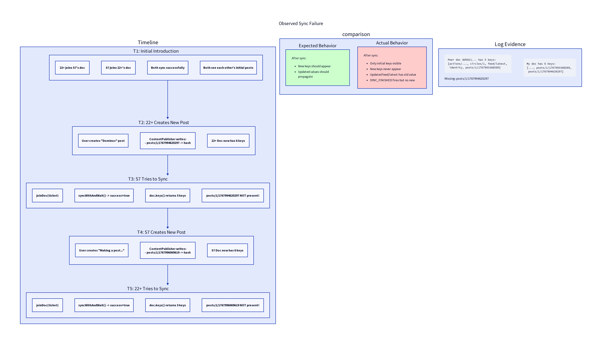

# Sync Failure Analysis



## Observed Problem

New entries written to Iroh Docs are **not propagating** between devices, even though:
- Initial sync works correctly
- `syncWithAndWait()` returns `success = true`
- `SYNC_FINISHED` events fire

## Timeline of Events

### T1: Initial Introduction
- 22+ joins S7's Doc
- S7 joins 22+'s Doc
- Both sync successfully
- **Result**: Both see each other's initial posts

### T2: 22+ Creates New Post
- User creates "Dominos" post on 22+
- ContentPublisher writes: `posts/1/1767994620297 -> hash`
- 22+ Doc now has **6 keys**

### T3: S7 Tries to Sync
- S7 calls `joinDoc(ticket)`
- S7 calls `syncWithAndWait()` -> returns `success = true`
- S7 queries `doc.keys()` -> returns **5 keys**
- **Missing**: `posts/1/1767994620297` NOT present!

### T4: S7 Creates New Post
- User creates "Making a post..." on S7
- ContentPublisher writes: `posts/1/1767996069619 -> hash`
- S7 Doc now has **6 keys**

### T5: 22+ Tries to Sync
- Same pattern: sync "succeeds" but new key missing
- 22+ still only sees 5 keys from S7

## Expected vs Actual

| Expected | Actual |
|----------|--------|
| After sync, new keys should appear | Only initial keys visible |
| Updated values should propagate | feed/latest has old hash |
| Both devices see same data | Each device sees stale data |
| SYNC_FINISHED means data transferred | SYNC_FINISHED fires but no new data |

## Log Evidence

### S7 Log
```
Peer doc dd5021... has 5 keys:
[actions/..., circles/1, feed/latest, identity, posts/1/1767993388589]
```
Missing: `posts/1/1767994620297`

### 22+ Log
```
My doc has 6 keys:
[..., posts/1/1767993388589, posts/1/1767994620297]
```

## What We've Tried

### 1. Longer Delays
Added delays after sync to allow propagation. **No effect**.

### 2. syncWithAndWait()
Explicitly wait for `SYNC_FINISHED` event. **Still missing entries**.

### 3. Leave + Rejoin
Leave existing replica before joining fresh:
```kotlin
iroh.openDoc(peer.docNamespaceId)?.leave()
val doc = iroh.joinDoc(peer.docTicket)
```
**Still missing entries**.

### 4. Key Enumeration
Checked if it's a pagination issue with `keys()`:
- All entries fit in a single response
- `keysWithPrefix()` returns same results
- **Not a pagination issue**

## Possible Causes

### 1. Iroh Bug
Set reconciliation may have a bug where entries added after initial sync aren't recognized.

### 2. Author ID Mismatch
Entries have an author ID. If the author changes (new node instance?), entries might not merge correctly.

### 3. Replica Isolation
The local replica might be isolated from the network after creation, not receiving updates.

### 4. Connection Issues
NAT traversal or relay issues might prevent actual data transfer despite protocol "success".

## Next Steps

1. **Test with Iroh CLI**: Use `iroh doc` commands directly to verify if the issue is in our wrapper or in Iroh itself.

2. **Check Entry Metadata**: Log full entry details (author, timestamp) to verify they're correct.

3. **Manual Blob Sync**: Try explicit blob download to see if the blob store has the content.

4. **Report to Iroh**: If confirmed as Iroh issue, report to n0-computer/iroh.

## Workaround Ideas

1. **Polling multiple times**: Retry sync with delays
2. **Use gossip**: Add a separate gossip channel for new entry notifications
3. **Direct blob exchange**: Share blob hashes out-of-band and download directly
