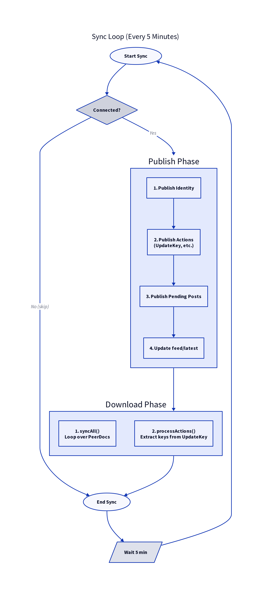

# Background Sync Loop



## IrohService

`IrohService` is an Android **foreground service** that runs the sync loop. It:
- Displays a persistent notification
- Survives app backgrounding
- Triggers sync every 60 seconds

## Service Lifecycle

```kotlin
class IrohService : Service() {
    override fun onStartCommand(intent: Intent?, flags: Int, startId: Int): Int {
        startForeground(NOTIFICATION_ID, createNotification())
        startSyncLoop()
        return START_STICKY
    }

    private fun startSyncLoop() {
        serviceScope.launch {
            while (isActive) {
                sync()
                delay(60_000)  // 60 seconds
            }
        }
    }
}
```

## Sync Operation

Each sync cycle performs two operations:

### 1. Publish Local Content
```kotlin
ContentPublisher.publishPending()
ContentPublisher.publishActions()
```

Publishes any content created since last sync:
- New posts
- Updated identity
- Pending actions (key exchanges)

### 2. Download Peer Content
```kotlin
ContentDownloader.syncAll()
```

For each subscribed peer:
- Join their Doc
- Wait for sync
- Download new content

## Manual Refresh

Users can trigger a manual sync via the refresh button:

```kotlin
fun onRefreshClicked() {
    lifecycleScope.launch {
        // Start service if not running
        startService(Intent(context, IrohService::class.java))

        // Trigger immediate sync
        IrohService.instance?.sync()
    }
}
```

## Sync Triggers

| Trigger | Action |
|---------|--------|
| App launch | Service started, first sync |
| 60-second timer | Automatic sync |
| Refresh button | Manual sync |
| Post created | Sync to publish |

## Service Binding

Components can bind to `IrohService` to:
- Trigger manual syncs
- Check sync status
- Observe sync events

```kotlin
val binder = IrohService.LocalBinder()
binder.sync()  // Trigger immediate sync
```

## Important Notes

1. **Foreground service**: Required for reliable background operation on modern Android
2. **60-second interval**: Balances freshness vs battery usage
3. **Publish-then-download**: Ensures local content is available before syncing peers
