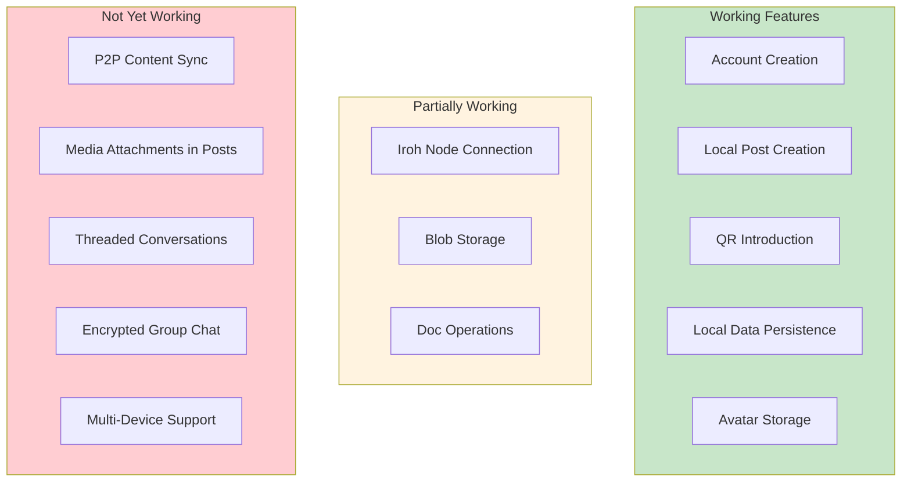
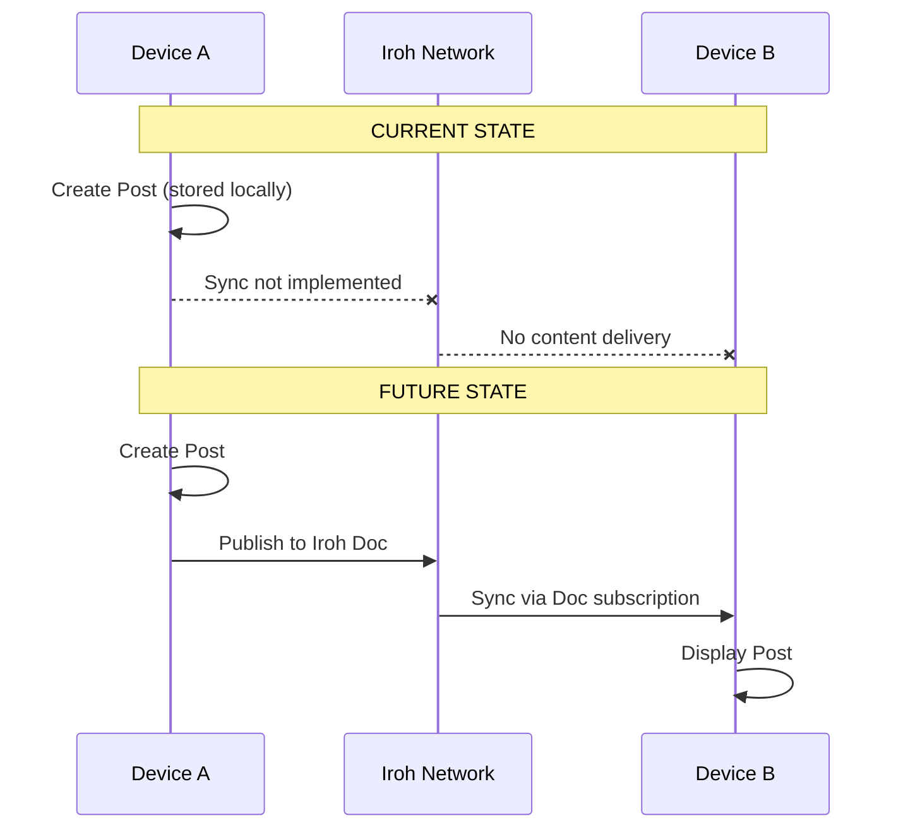
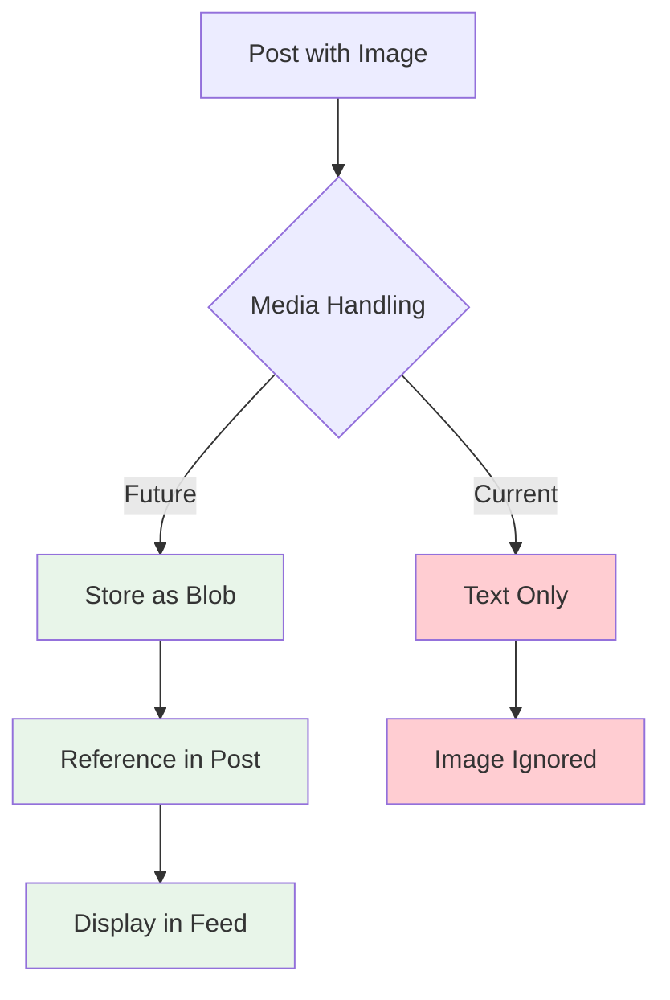
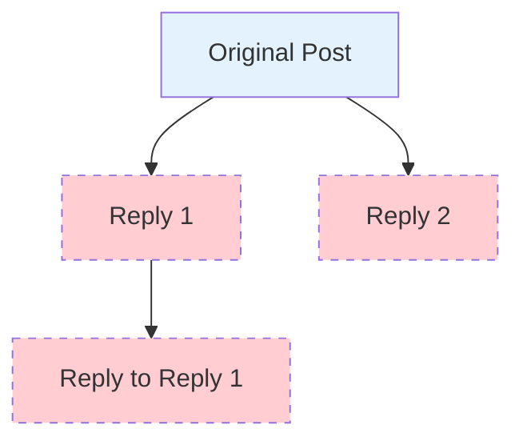
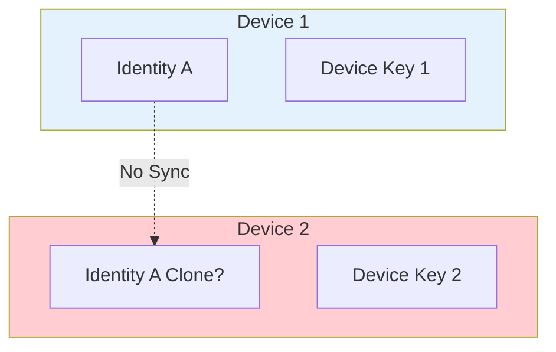
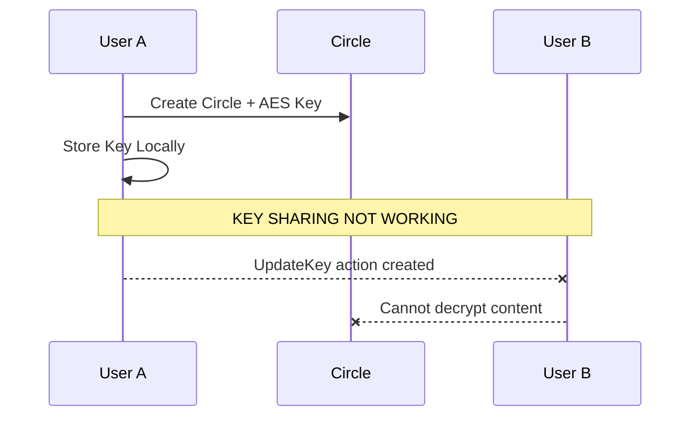
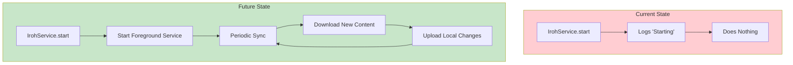

# Out of Scope Features

## Overview

This document lists features that are **not currently implemented** or **not expected to work** during post-migration testing. These are known limitations that should not be considered test failures.

---

## Feature Status Matrix

---

## 1. Peer-to-Peer Content Synchronization

### Status: Not Implemented

### What Works
- Local post creation and storage
- Signing posts with RSA key
- Storing posts in Room database

### What Doesn't Work
- Publishing posts to Iroh network
- Subscribing to other users' docs
- Receiving posts from peers
- Real-time content updates

### Why
The IrohService background sync has been stubbed out during migration. The old IPFS-based sync logic needs to be rewritten for Iroh's Doc-based model.

---

## 2. Media Attachments

### Status: Disabled

### What Works
- PostFile model exists in database
- Blob storage API is functional

### What Doesn't Work
- Attaching images to posts
- Displaying images in feed
- Image compression/optimization
- Video attachments

### Why
PostAdapter's image rendering is commented out. The file selection UI is not connected to the post creation flow.

---

## 3. Threaded Conversations

### Status: Not Implemented

### What Works
- Post model has `replyTo` field
- Database can store reply relationships

### What Doesn't Work
- UI for replying to posts
- Thread view/display
- Reply notification

### Why
UI components for threading were never fully implemented. The data model supports it but no UI exists.

---

## 4. Multi-Device Support

### Status: Not Supported

### What Works
- Single device per identity
- Device key stored in Android KeyStore

### What Doesn't Work
- Identity export/import
- Key synchronization between devices
- Multi-device posting

### Why
Each device generates its own RSA keypair. There's no mechanism to transfer or sync identity keys between devices.

---

## 5. Circle Key Distribution

### Status: Partially Implemented

### What Works
- Circle creation
- AES key generation
- Local key storage

### What Doesn't Work
- Key sharing via UpdateKey actions
- Receiving circle keys from peers
- Decrypting peer content

### Why
The action publishing system (UpdateKey, AddToCircle, etc.) is not connected to Iroh sync.

---

## 6. Background Sync Service

### Status: Stubbed

### What Works
- Service class exists
- Service can be started

### What Doesn't Work
- Actual background synchronization
- Periodic content checks
- Push notifications
- Battery-efficient sync scheduling

### Why
All old IPFS worker code was removed. New Iroh-based sync logic needs to be implemented.

---

## 7. Feed Download from Peers

### Status: Not Working

### What Works
- Subscription model exists
- User storage after QR introduction

### What Doesn't Work
- Downloading peer's feed manifest
- Retrieving peer's posts
- Updating subscription content

### Why
The old `FeedDownloader` and related workers used IPFS/IPNS. New Iroh-based download logic is needed.

---

## 8. Content Discovery

### Status: Not Implemented

### What Works
- Manual QR code introduction

### What Doesn't Work
- Finding users by name
- Discovering content by topic
- Relay-based peer discovery

### Why
Bailiwick is designed for explicit consent-based connections. Discovery was never a design goal, but relay-based improvements could help with NAT traversal.

---

## Summary Table

| Feature | Status | Blocker |
|---------|--------|---------|
| P2P Content Sync | Not Working | IrohService needs implementation |
| Media Attachments | Disabled | PostAdapter rendering commented out |
| Threaded Conversations | Not Implemented | No UI components |
| Multi-Device | Not Supported | No key sync mechanism |
| Circle Key Sharing | Partial | Action publishing not connected |
| Background Sync | Stubbed | Worker logic needs rewrite |
| Feed Download | Not Working | Downloader needs rewrite |
| Content Discovery | Not Implemented | By design (privacy focus) |

---

## Testing Recommendations

When testing the app post-migration:

1. **Focus on local functionality first**
   - Account creation
   - Post creation (text only)
   - Data persistence
   - QR code generation/scanning

2. **Test Iroh primitives**
   - Blob storage/retrieval
   - Doc creation
   - Node ID display

3. **Skip multi-device scenarios**
   - These will fail; don't report as bugs

4. **Don't expect content to appear on other devices**
   - This is the main feature gap to be addressed next
