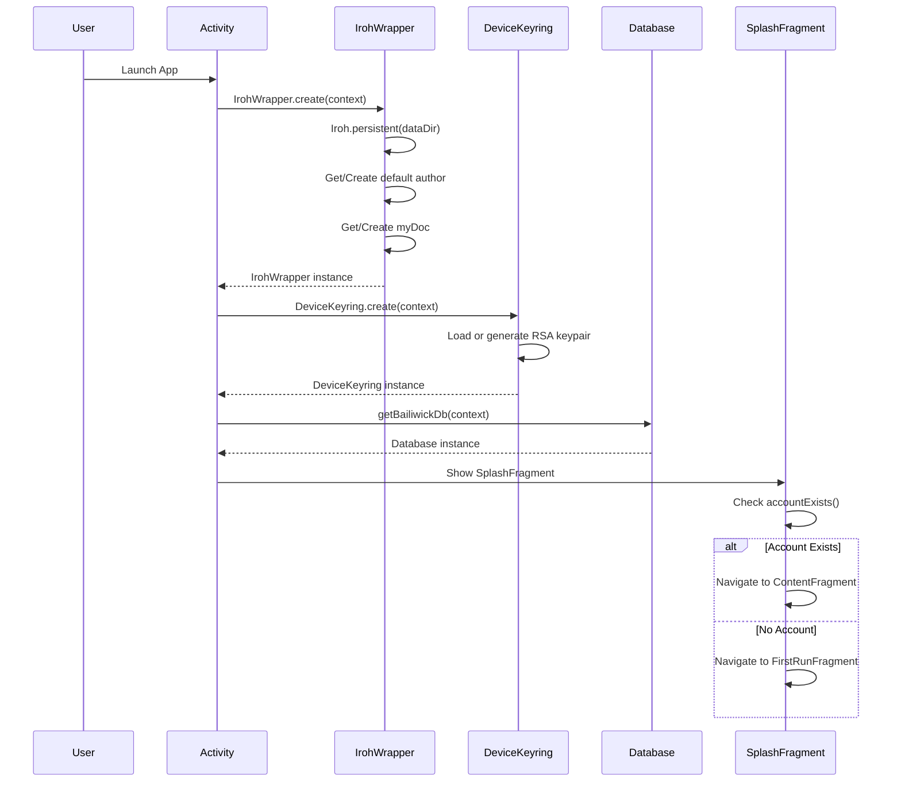
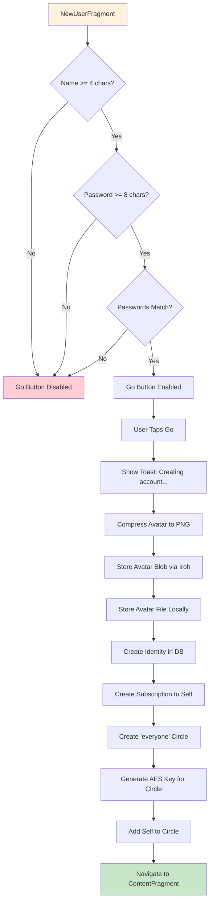
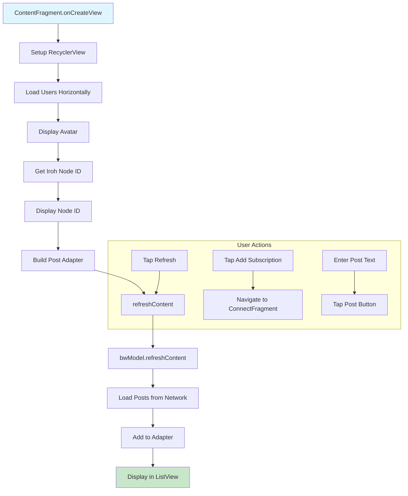
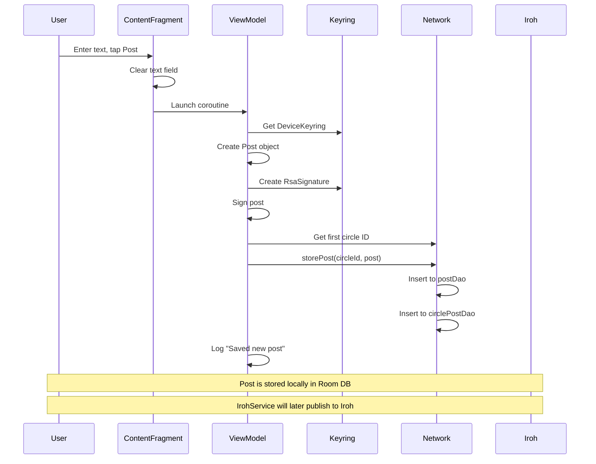
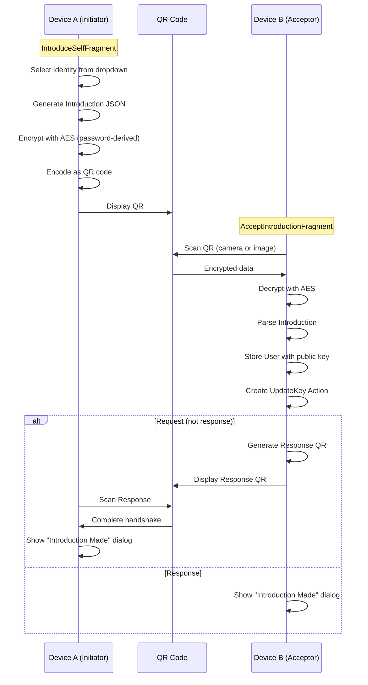
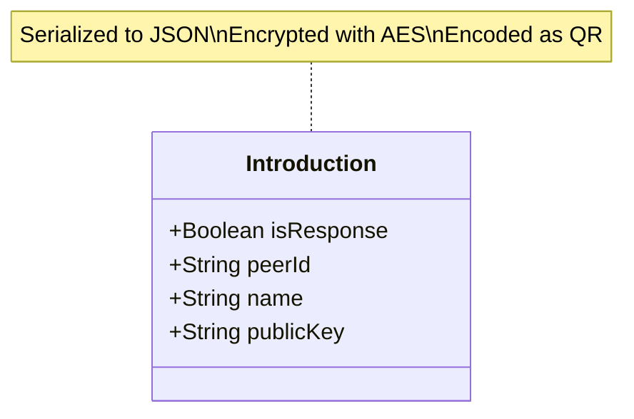
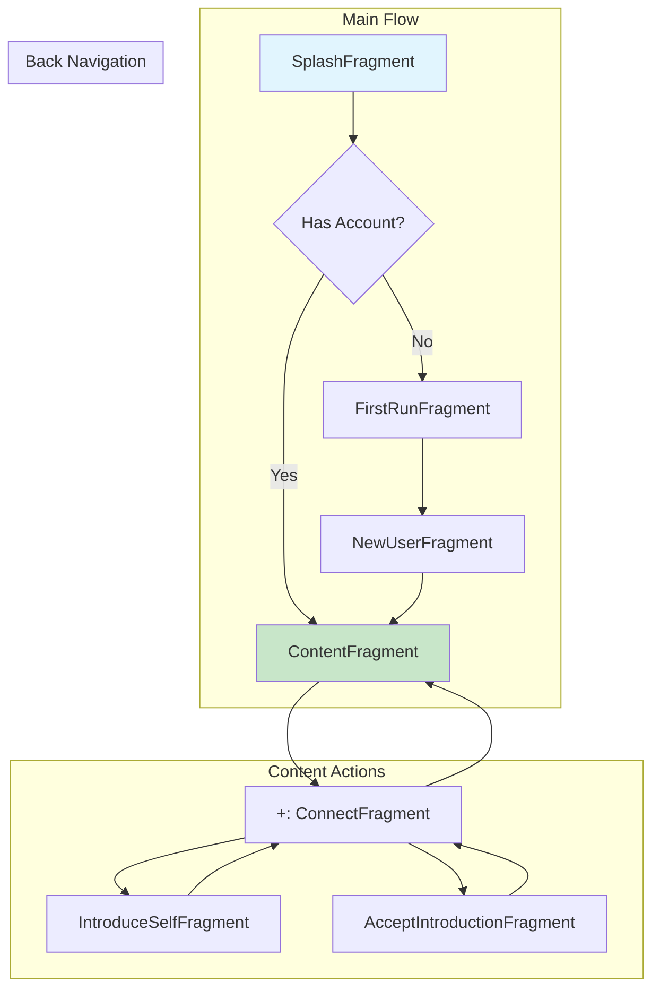
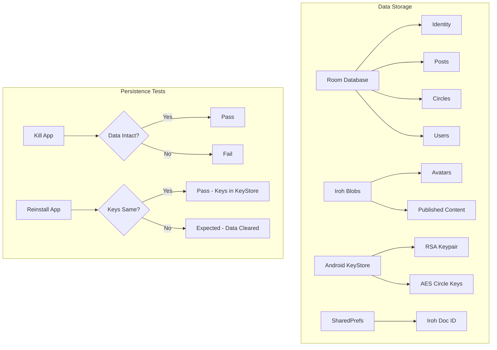

# Detailed Test Cases

## Table of Contents

1. [App Launch & Initialization](#1-app-launch--initialization)
2. [Account Creation](#2-account-creation)
3. [Content Feed](#3-content-feed)
4. [Post Creation](#4-post-creation)
5. [QR Introduction Flow](#5-qr-introduction-flow)
6. [Navigation](#6-navigation)
7. [Error Handling](#7-error-handling)
8. [Persistence](#8-persistence)

---

## 1. App Launch & Initialization

### Workflow



### Test Cases

| ID | Test Case | Steps | Expected Result | Priority |
|----|-----------|-------|-----------------|----------|
| 1.1 | Cold Start | Fresh install, launch app | Splash screen appears within 3s | Blocking |
| 1.2 | Iroh Init | Check logcat during launch | "Iroh initialized. NodeId: X, DocId: Y" | Blocking |
| 1.3 | Keyring Init | Check logcat during launch | "Loading existing device keypair" or "Generating new device keypair" | Blocking |
| 1.4 | Splash Navigation (New) | First launch after fresh install | Navigates to NewUserFragment | Blocking |
| 1.5 | Splash Navigation (Existing) | Launch with existing account | Navigates to ContentFragment | Blocking |
| 1.6 | Warm Start | Background app, reopen | Resumes without re-init | Important |

### Validation Commands

```bash
# Watch Iroh initialization
adb logcat -s IrohWrapper:I | grep -E "Initializing|initialized"

# Watch Keyring initialization
adb logcat -s DeviceKeyring:I

# Watch navigation
adb logcat | grep -E "SplashFragment|ContentFragment|NewUserFragment"
```

### Pass Criteria

- [ ] No crash on launch
- [ ] Node ID is 64-character hex string
- [ ] Doc ID is 52-character base32 string
- [ ] Navigation completes within 5 seconds

---

## 2. Account Creation

### Workflow



### Test Cases

| ID | Test Case | Steps | Expected Result | Priority |
|----|-----------|-------|-----------------|----------|
| 2.1 | Name Too Short | Enter "abc" (3 chars) | Go button disabled | Important |
| 2.2 | Name Valid | Enter "Test User" | Partial enable (need password) | Important |
| 2.3 | Password Too Short | Enter "1234567" (7 chars) | Go button disabled | Important |
| 2.4 | Password Mismatch | Enter different passwords | Go button disabled | Important |
| 2.5 | All Valid | Name 4+, matching passwords 8+ | Go button enabled | Blocking |
| 2.6 | Avatar Tap | Tap avatar image | Random avatar loads | Important |
| 2.7 | Account Created | Tap Go with valid inputs | Toast shown, navigates to Content | Blocking |
| 2.8 | Quick Create Debug | Tap "Lucas Taylor" button | Account created immediately | Blocking |
| 2.9 | Random Create Debug | Tap "Rando" button | Account with random name created | Important |

### Validation Commands

```bash
# Watch account creation
adb logcat | grep -E "storeBlob|Creating account|Circle|Identity"

# Check database
adb shell "run-as com.perfectlunacy.bailiwick cat databases/bailiwick-db" | head
```

### Pass Criteria

- [ ] Validation rules enforced correctly
- [ ] Avatar stored as Iroh blob
- [ ] Identity created in database
- [ ] "everyone" circle created
- [ ] Navigation to Content successful

---

## 3. Content Feed

### Workflow



### Test Cases

| ID | Test Case | Steps | Expected Result | Priority |
|----|-----------|-------|-----------------|----------|
| 3.1 | Node ID Display | View Content screen | 64-char hex Node ID shown | Blocking |
| 3.2 | Avatar Display | View Content screen | Your avatar in top-left | Important |
| 3.3 | Empty State | New account, no posts | Empty list, no crash | Blocking |
| 3.4 | Refresh Button | Tap refresh icon | Triggers refreshContent(), no crash | Important |
| 3.5 | User List | Multiple identities | Horizontal scroll of users | Important |
| 3.6 | Post List Scroll | Many posts | Smooth scrolling, no jank | Important |

### Validation Commands

```bash
# Watch content loading
adb logcat -s ContentFragment:* BailiwickViewModel:*

# Check Node ID format
adb logcat | grep "txtPeer.text"
```

### Pass Criteria

- [ ] Node ID displays correctly
- [ ] Avatar loads without error
- [ ] Empty state doesn't crash
- [ ] Refresh completes without error

---

## 4. Post Creation

### Workflow



### Test Cases

| ID | Test Case | Steps | Expected Result | Priority |
|----|-----------|-------|-----------------|----------|
| 4.1 | Empty Post | Leave text empty, tap Post | Nothing happens or button disabled | Important |
| 4.2 | Create Simple Post | Enter "Hello World", tap Post | Text clears, logcat shows save | Blocking |
| 4.3 | Post Has Signature | Create post, check logcat | Signature field populated | Important |
| 4.4 | Post Has Timestamp | Create post, check DB | Timestamp is current time | Important |
| 4.5 | Post Appears | Create, tap Refresh | Post visible in feed | Blocking |
| 4.6 | Post Order | Create multiple posts | Newest first (descending time) | Important |
| 4.7 | Long Text | Enter 500+ characters | Post created without truncation | Important |
| 4.8 | Special Characters | Enter emoji, unicode | Characters preserved correctly | Important |

### Validation Commands

```bash
# Watch post creation
adb logcat | grep -E "Saved new post|storePost|RsaSignature"

# Verify signature
adb logcat | grep "sign"
```

### Pass Criteria

- [ ] Posts save without error
- [ ] Posts are signed with RSA key
- [ ] Posts appear after refresh
- [ ] Post ordering is correct

---

## 5. QR Introduction Flow

### Workflow



### Introduction Data Structure



### Test Cases - Device A (Initiator)

| ID | Test Case | Steps | Expected Result | Priority |
|----|-----------|-------|-----------------|----------|
| 5.1 | Navigate to Introduce | Tap "+" button | IntroduceSelfFragment loads | Important |
| 5.2 | Identity Dropdown | View dropdown | Lists created identities | Important |
| 5.3 | Select Identity | Pick identity | Name + avatar display | Important |
| 5.4 | QR Generated | Identity selected | QR code image visible | Blocking |
| 5.5 | Share QR | Tap "Request" | Share sheet with image | Important |

### Test Cases - Device B (Acceptor)

| ID | Test Case | Steps | Expected Result | Priority |
|----|-----------|-------|-----------------|----------|
| 5.6 | Navigate to Accept | Tap "+" button | AcceptIntroductionFragment loads | Important |
| 5.7 | Camera Scan | Tap Scan, point at QR | QR decoded, intro processed | Blocking |
| 5.8 | Image Scan | Tap Images, select QR file | QR decoded from file | Important |
| 5.9 | Response Generated | After scanning request | Response QR appears | Blocking |
| 5.10 | Share Response | Tap Send | Share sheet with response QR | Important |

### Test Cases - Complete Handshake

| ID | Test Case | Steps | Expected Result | Priority |
|----|-----------|-------|-----------------|----------|
| 5.11 | Full Introduction | A→B request, B→A response, A scans | Both see "Introduction Made" | Blocking |
| 5.12 | User Stored | Complete handshake | User in database with pubkey | Blocking |
| 5.13 | Duplicate User | Scan same user again | "Already friends" toast | Important |

### Validation Commands

```bash
# Watch QR processing
adb logcat | grep -E "Introduction|QR|Accept|buildRequest|buildResponse"

# Check user storage
adb logcat | grep -E "userDao|insert.*User"
```

### Pass Criteria

- [ ] QR codes generate correctly
- [ ] Camera scanning works
- [ ] Image file scanning works
- [ ] Full handshake completes
- [ ] Users stored in database

---

## 6. Navigation

### Workflow



### Test Cases

| ID | Test Case | Steps | Expected Result | Priority |
|----|-----------|-------|-----------------|----------|
| 6.1 | Content to Connect | Tap "+" subscription | Navigate to Connect | Important |
| 6.2 | Back from Connect | Press back | Return to Content | Important |
| 6.3 | Rotation Survival | Rotate device | No crash, state preserved | Important |
| 6.4 | Deep Navigation | Go 3+ screens deep, back | Returns correctly through stack | Important |
| 6.5 | Home Press | Press home, return | App resumes correctly | Important |

### Pass Criteria

- [ ] All navigation paths work
- [ ] Back button functions correctly
- [ ] Rotation doesn't crash
- [ ] App resumes from background

---

## 7. Error Handling

### Test Cases

| ID | Test Case | Steps | Expected Result | Priority |
|----|-----------|-------|-----------------|----------|
| 7.1 | No Network Launch | Airplane mode, launch | App starts, graceful degradation | Important |
| 7.2 | Network Restore | Disable airplane mode | Iroh reconnects | Important |
| 7.3 | Invalid QR | Scan random QR code | Error toast, no crash | Important |
| 7.4 | Corrupted QR | Scan partially visible QR | Error handled gracefully | Important |
| 7.5 | Empty Password QR | Use blank password | Default empty key used | Important |
| 7.6 | Low Memory | Open many apps, return | App recovers state | Important |
| 7.7 | Process Death | Force stop, reopen | App starts fresh, data intact | Important |

### Validation Commands

```bash
# Force stop app
adb shell am force-stop com.perfectlunacy.bailiwick

# Clear data (for fresh start test)
adb shell pm clear com.perfectlunacy.bailiwick

# Simulate low memory
adb shell am kill com.perfectlunacy.bailiwick
```

### Pass Criteria

- [ ] No unhandled exceptions
- [ ] User sees helpful error messages
- [ ] App recovers gracefully

---

## 8. Persistence

### Workflow



### Test Cases

| ID | Test Case | Steps | Expected Result | Priority |
|----|-----------|-------|-----------------|----------|
| 8.1 | Post Persistence | Create post, kill app, reopen | Post still visible | Blocking |
| 8.2 | Account Persistence | Create account, kill app | Account still exists | Blocking |
| 8.3 | Avatar Persistence | Set avatar, restart | Avatar still displays | Important |
| 8.4 | Node ID Persistence | Note ID, restart | Same Node ID | Important |
| 8.5 | Clear Data | Clear app data, launch | Fresh start, new keys | Important |

### Validation Commands

```bash
# Check database exists
adb shell "run-as com.perfectlunacy.bailiwick ls -la databases/"

# Check Iroh data
adb shell "run-as com.perfectlunacy.bailiwick ls -la files/iroh/"

# Check blob cache
adb shell "run-as com.perfectlunacy.bailiwick ls -la files/blobs/"
```

### Pass Criteria

- [ ] All data survives app restart
- [ ] All data survives process death
- [ ] Clear data properly resets app
