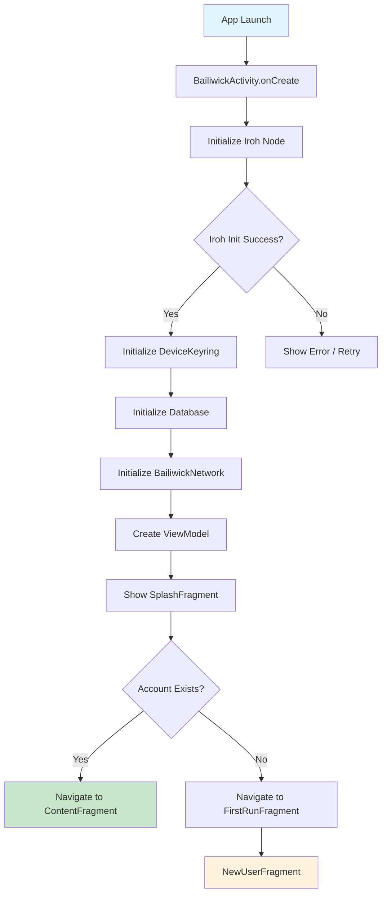
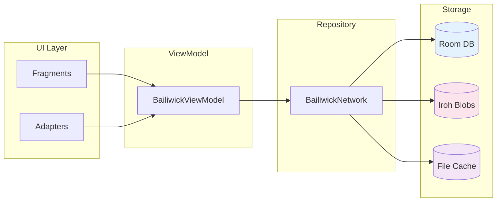

# Bailiwick Manual Test Plan

## Post-Iroh Migration Validation

This document provides a comprehensive test plan for validating the Bailiwick app after migrating from IPFS to Iroh.

---

## Table of Contents

1. [Test Environment](#test-environment)
2. [App Architecture Overview](#app-architecture-overview)
3. [Test Categories](#test-categories)
4. [Detailed Test Cases](./TEST_CASES.md)
5. [Out of Scope Features](./OUT_OF_SCOPE.md)
6. [Troubleshooting Guide](./TROUBLESHOOTING.md)

---

## Test Environment

### Prerequisites

| Requirement | Details |
|-------------|---------|
| Android Devices | 2+ devices, API 26+ (Android 8.0 Oreo or higher) |
| Network | Devices on same network (recommended) or internet access for relay |
| Build Tools | Android Studio or command-line Gradle |
| Debug Tools | ADB installed and configured |

### Build & Install

```bash
# Build debug APK
./gradlew assembleDebug

# Install on connected device
./gradlew installDebug

# Or install APK directly
adb install app/build/outputs/apk/debug/app-debug.apk
```

### Logcat Setup

```bash
# Full Bailiwick logging
adb logcat | grep -E "Iroh|Bailiwick|perfectlunacy"

# Errors only
adb logcat *:E | grep -E "perfectlunacy|iroh"

# Specific components
adb logcat -s IrohWrapper:* IrohService:* ContentFragment:* DeviceKeyring:*
```

---

## App Architecture Overview

### Initialization Flow



### Data Flow Architecture



---

## Test Categories

### Category Summary

| Category | Priority | Status |
|----------|----------|--------|
| [App Launch & Init](#1-app-launch--initialization) | **Blocking** | Must Pass |
| [Account Creation](#2-account-creation) | **Blocking** | Must Pass |
| [Content Feed](#3-content-feed) | **Blocking** | Must Pass |
| [Post Creation](#4-post-creation) | **Blocking** | Must Pass |
| [QR Introduction](#5-qr-introduction-flow) | Important | Should Pass |
| [Navigation](#6-navigation) | Important | Should Pass |
| [Error Handling](#7-error-handling) | Important | Should Pass |

### Test Result Legend

| Symbol | Meaning |
|--------|---------|
| ✅ | Pass |
| ❌ | Fail |
| ⚠️ | Pass with issues |
| ⏭️ | Skipped |
| ☐ | Not tested |

---

## Quick Validation Checklist

Use this for rapid smoke testing:

```
[ ] App launches without crash
[ ] Iroh node ID displayed (32-char hex)
[ ] Can create new account
[ ] Can create text post
[ ] Post appears in feed
[ ] Post persists after restart
[ ] QR code generates
[ ] QR code scans
[ ] No crashes on rotation
```

---

## Next Steps

1. **Review detailed test cases:** [TEST_CASES.md](./TEST_CASES.md)
2. **Understand limitations:** [OUT_OF_SCOPE.md](./OUT_OF_SCOPE.md)
3. **Debug issues:** [TROUBLESHOOTING.md](./TROUBLESHOOTING.md)
