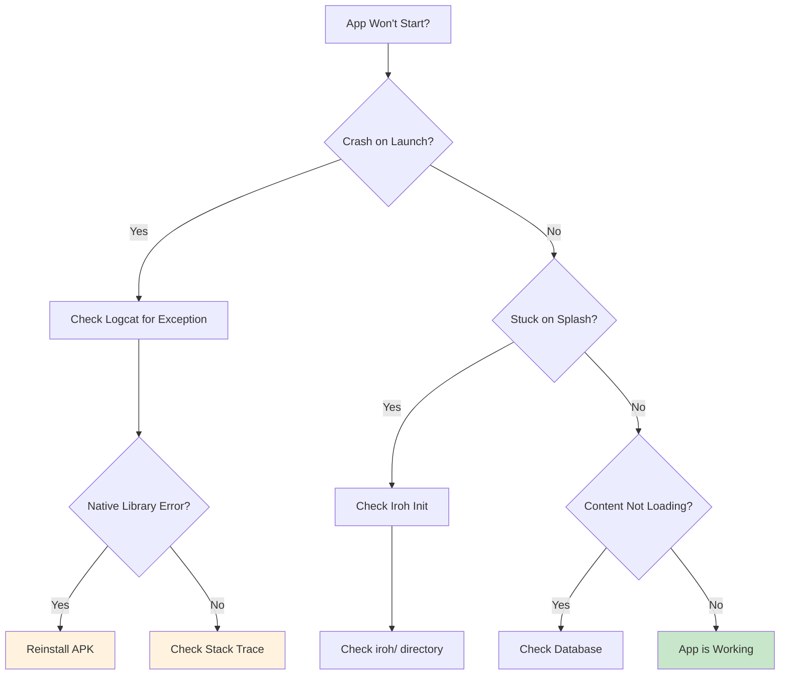
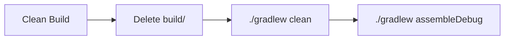
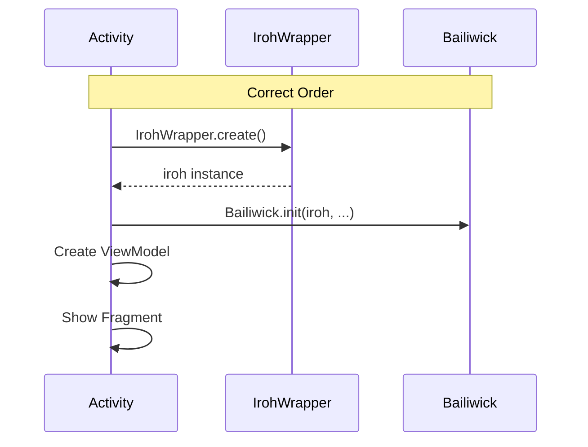
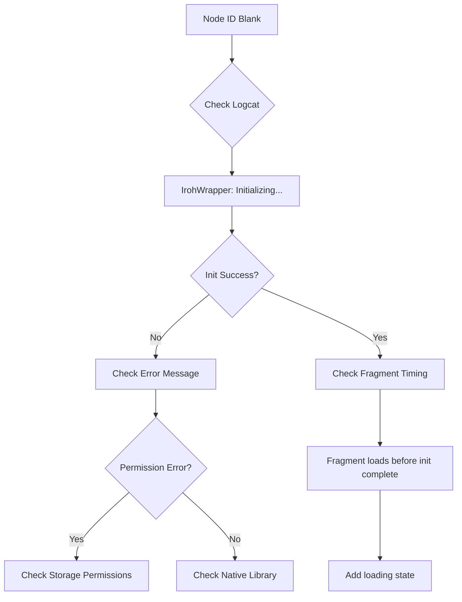
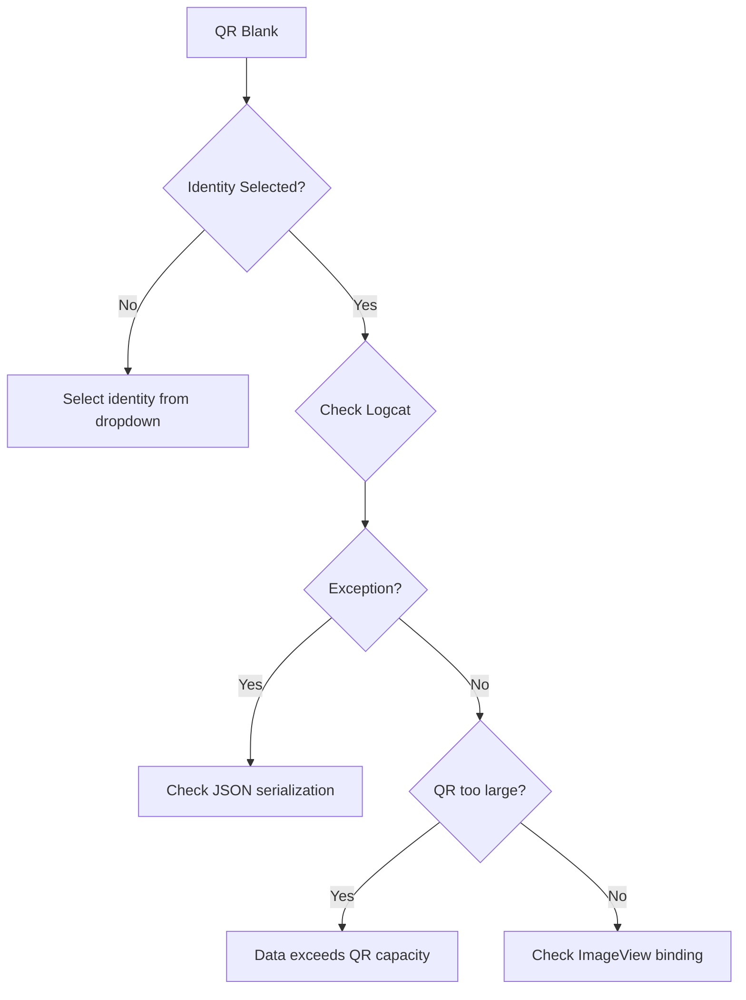
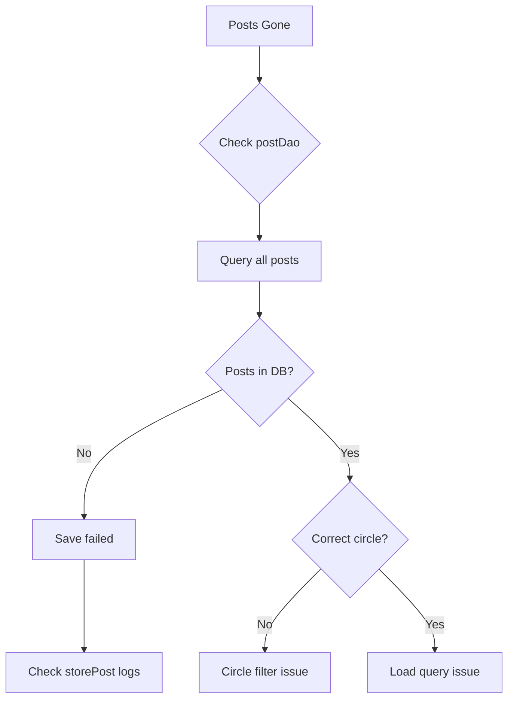

# Troubleshooting Guide

## Overview

This guide helps diagnose and resolve common issues encountered when testing Bailiwick after the Iroh migration.

---

## Table of Contents

1. [Quick Diagnostics](#quick-diagnostics)
2. [Build Issues](#build-issues)
3. [Runtime Crashes](#runtime-crashes)
4. [Iroh Issues](#iroh-issues)
5. [QR Code Issues](#qr-code-issues)
6. [Database Issues](#database-issues)
7. [Logcat Reference](#logcat-reference)

---

## Quick Diagnostics

### Health Check Flow



### One-Liner Diagnostics

```bash
# Check if app is running
adb shell pidof com.perfectlunacy.bailiwick

# Get crash log
adb logcat -d | grep -A 20 "FATAL EXCEPTION"

# Check Iroh status
adb logcat -d | grep "IrohWrapper"

# Check database exists
adb shell "run-as com.perfectlunacy.bailiwick ls databases/"

# Check Iroh data exists
adb shell "run-as com.perfectlunacy.bailiwick ls files/iroh/"
```

---

## Build Issues

### Issue: "Could not load module" Error

**Symptom:**
```
Could not load module <Error module>
```

**Cause:** Missing or incompatible native library.

**Solution:**



```bash
# Full clean rebuild
rm -rf app/build
./gradlew clean
./gradlew assembleDebug
```

### Issue: JNA Library Not Found

**Symptom:**
```
java.lang.UnsatisfiedLinkError: Unable to load library 'iroh'
```

**Cause:** Native library not bundled or wrong ABI.

**Solution:**

1. Check that `iroh-ffi` dependency is in `build.gradle`
2. Verify device ABI matches available native libs:

```bash
# Check device ABI
adb shell getprop ro.product.cpu.abi

# Should be one of: arm64-v8a, armeabi-v7a, x86_64, x86
```

### Issue: Kotlin Version Mismatch

**Symptom:**
```
Module was compiled with an incompatible version of Kotlin
```

**Solution:**

```bash
# Check project Kotlin version in build.gradle
grep "kotlin" build.gradle

# Should be 1.9.22 or compatible
```

---

## Runtime Crashes

### Issue: Crash on Launch - NullPointerException

**Symptom:**
```
java.lang.NullPointerException: ... Bailiwick.getInstance().iroh
```

**Cause:** Iroh not initialized before fragment access.

**Diagnostic:**

```bash
adb logcat | grep -E "IrohWrapper|Bailiwick.init"
```

**Solution Flow:**



Check that `BailiwickActivity.onCreate()` initializes in correct order.

### Issue: Crash on Rotation

**Symptom:** App crashes when rotating device.

**Cause:** Fragment accessing null binding after recreation.

**Diagnostic:**

```bash
adb logcat | grep -E "onCreateView|onDestroyView|_binding"
```

**Common Fix:** Check for `_binding?.let { ... }` guards in fragment code.

### Issue: Crash When Creating Post

**Symptom:**
```
java.lang.NullPointerException: network.me
```

**Cause:** No identity/account exists yet.

**Solution:**
1. Create account first via NewUserFragment
2. Check that account creation completes successfully

```bash
adb logcat | grep -E "Identity|createAccount"
```

---

## Iroh Issues

### Issue: Node ID Not Displaying

**Symptom:** Node ID shows "not initialized" or is blank.

**Diagnostic Flow:**



**Commands:**

```bash
# Watch Iroh initialization
adb logcat -s IrohWrapper:*

# Check for permission issues
adb logcat | grep -E "Permission|denied"

# Check iroh data directory
adb shell "run-as com.perfectlunacy.bailiwick ls -la files/iroh/"
```

### Issue: Blobs Not Storing

**Symptom:** `storeBlob()` fails silently or throws exception.

**Diagnostic:**

```bash
adb logcat | grep -E "storeBlob|addBytes|IrohException"
```

**Common Causes:**

| Cause | Solution |
|-------|----------|
| Disk full | Clear app data or device storage |
| Iroh not initialized | Check init order |
| Corrupted data dir | Clear app data, reinstall |

### Issue: Doc Operations Fail

**Symptom:** `openDoc()` returns null, `createDoc()` throws.

**Diagnostic:**

```bash
adb logcat | grep -E "Doc|docs\\.create|docs\\.open"
```

**Solution:**
1. Check that doc namespace ID is valid (52-char base32)
2. Verify doc was created before opening
3. Check SharedPreferences for saved doc ID:

```bash
adb shell "run-as com.perfectlunacy.bailiwick cat shared_prefs/iroh_config.xml"
```

---

## QR Code Issues

### Issue: QR Code Not Generating

**Symptom:** QR image view is blank or shows placeholder.

**Diagnostic:**

```bash
adb logcat | grep -E "QR|buildRequest|Introduction"
```

**Common Causes:**



### Issue: QR Scan Not Working

**Symptom:** Camera opens but doesn't detect QR codes.

**Checklist:**

1. Camera permission granted?
2. QR code in focus and well-lit?
3. QR code from Bailiwick (not random QR)?

**Diagnostic:**

```bash
adb logcat | grep -E "camera|scan|QR|decode"
```

### Issue: "Invalid Introduction" After Scan

**Symptom:** QR scans but shows error about invalid data.

**Causes:**

| Symptom | Cause | Solution |
|---------|-------|----------|
| Decryption failed | Wrong password | Use same password on both devices |
| JSON parse error | Corrupted QR | Re-generate QR code |
| Missing fields | Version mismatch | Use same app version |

**Diagnostic:**

```bash
adb logcat | grep -E "decrypt|parse|Introduction"
```

---

## Database Issues

### Issue: Account Not Persisting

**Symptom:** Account disappears after app restart.

**Diagnostic:**

```bash
# Check database file
adb shell "run-as com.perfectlunacy.bailiwick ls -la databases/"

# Check for database errors
adb logcat | grep -E "Room|SQLite|database"
```

**Common Causes:**

1. Database migration failed
2. Entity not added to `@Database` annotation
3. Exception during save (check logcat)

### Issue: Posts Disappear

**Symptom:** Posts visible, then gone after restart.

**Diagnostic Flow:**



```bash
# Check post storage
adb logcat | grep -E "storePost|postDao|insert"
```

### Issue: Database Locked

**Symptom:**
```
SQLiteDatabaseLockedException: database is locked
```

**Cause:** Multiple threads accessing DB without proper synchronization.

**Solution:** Ensure all DB access goes through DAOs with Room's built-in thread safety.

---

## Logcat Reference

### Essential Log Tags

```bash
# Core components
adb logcat -s IrohWrapper:* IrohService:* Bailiwick:*

# Fragments
adb logcat -s ContentFragment:* NewUserFragment:* SplashFragment:*

# Database
adb logcat -s BailiwickDb:* Room:*

# Crypto
adb logcat -s DeviceKeyring:* RsaSignature:*
```

### Filtered Views

```bash
# Errors only
adb logcat *:E | grep -i bailiwick

# Initialization sequence
adb logcat | grep -E "onCreate|Initializing|initialized|create\("

# Post flow
adb logcat | grep -E "Post|storePost|sign|circle"

# QR flow
adb logcat | grep -E "Introduction|QR|scan|Accept"
```

### Log Level Reference

| Level | Meaning | When to Use |
|-------|---------|-------------|
| V (Verbose) | Detailed debugging | Deep investigation |
| D (Debug) | Debug info | Development |
| I (Info) | Normal operation | General testing |
| W (Warning) | Potential issues | Monitor these |
| E (Error) | Errors | Must investigate |

---

## Reset Procedures

### Soft Reset (Preserve Keys)

```bash
# Clear app data except KeyStore
adb shell pm clear com.perfectlunacy.bailiwick
```

Note: This keeps the RSA keypair in Android KeyStore but clears everything else.

### Hard Reset (Full Clean)

```bash
# Uninstall completely
adb uninstall com.perfectlunacy.bailiwick

# Reinstall
adb install app/build/outputs/apk/debug/app-debug.apk
```

### Database Only Reset

```bash
# Delete just the database
adb shell "run-as com.perfectlunacy.bailiwick rm -rf databases/"
```

### Iroh Data Reset

```bash
# Delete Iroh state (new node ID on next launch)
adb shell "run-as com.perfectlunacy.bailiwick rm -rf files/iroh/"
adb shell "run-as com.perfectlunacy.bailiwick rm shared_prefs/iroh_config.xml"
```

---

## Getting Help

### Information to Collect

When reporting issues, include:

1. **Device info:**
   ```bash
   adb shell getprop ro.product.model
   adb shell getprop ro.build.version.sdk
   ```

2. **App version:**
   ```bash
   adb shell dumpsys package com.perfectlunacy.bailiwick | grep version
   ```

3. **Relevant logcat:**
   ```bash
   adb logcat -d > logcat.txt
   ```

4. **Steps to reproduce**

5. **Expected vs actual behavior**

### Debug Build Features

The debug build includes:
- Verbose logging
- "Lucas Taylor" quick-create button
- "Rando" random account button
- Visible Node ID on content screen
